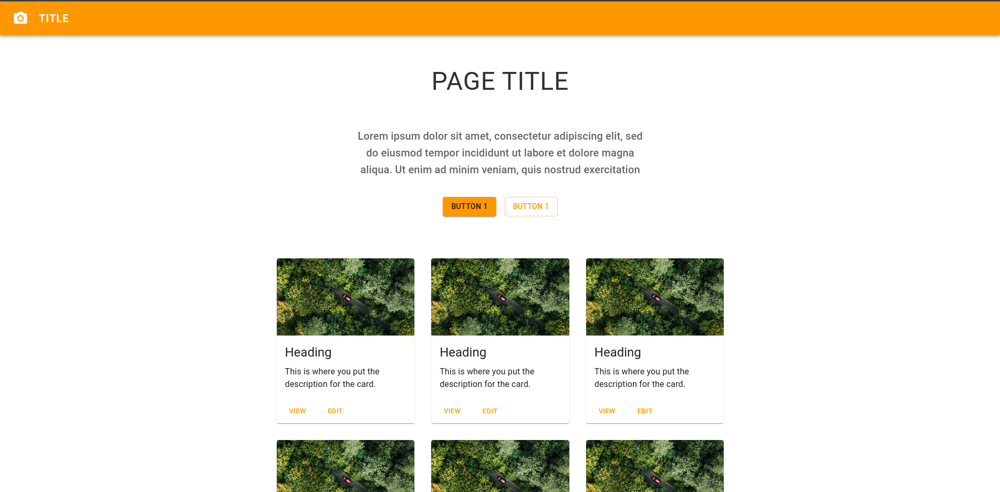
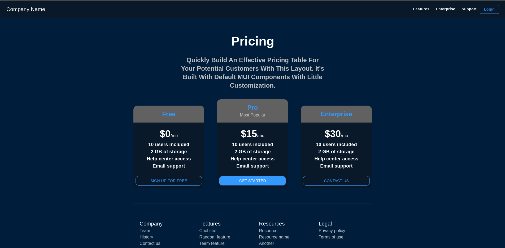
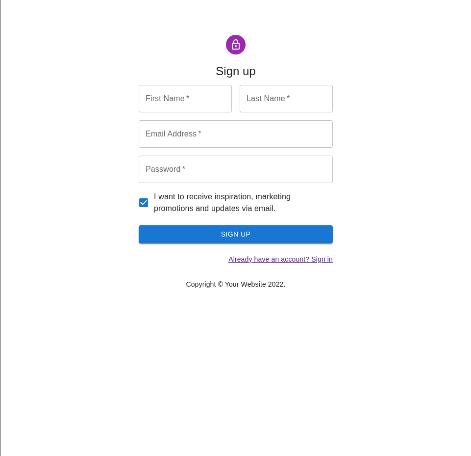
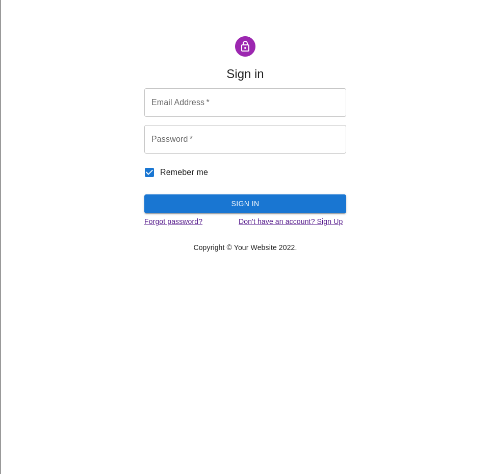

# Demo websites
I prefer to learn things by doing, these are some demo projects and clones which helped me understand the basics of React js and MUI.
 

## Album
<a href="https://mui.com/material-ui/getting-started/templates/album/">Original version</a>

 

<a href="https://mui.com/material-ui/getting-started/templates/pricing/">Original version</a>

|<a href="https://mui.com/material-ui/getting-started/templates/sign-up/">Original version</a>|<a href="https://mui.com/material-ui/getting-started/templates/sign-up/">Original version</a>|
|----|----|
|||